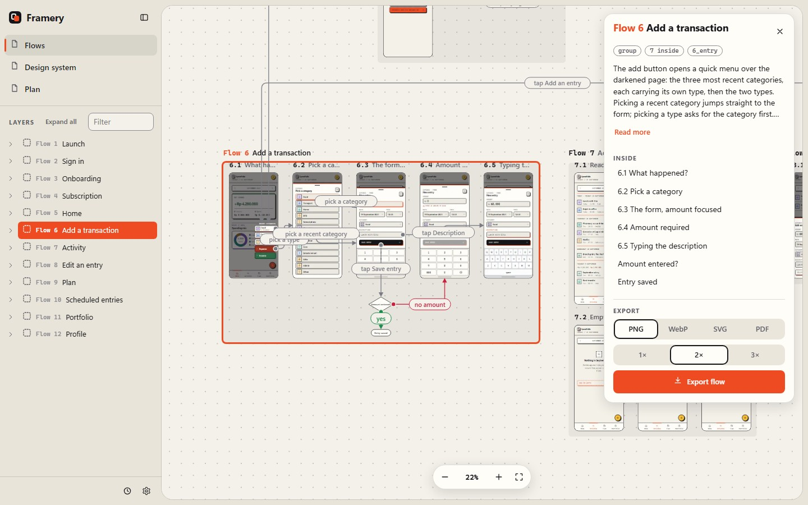
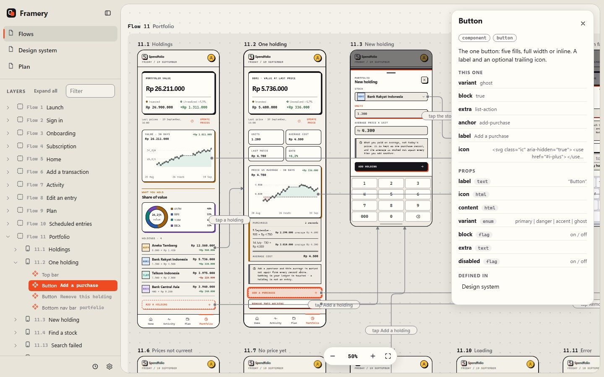
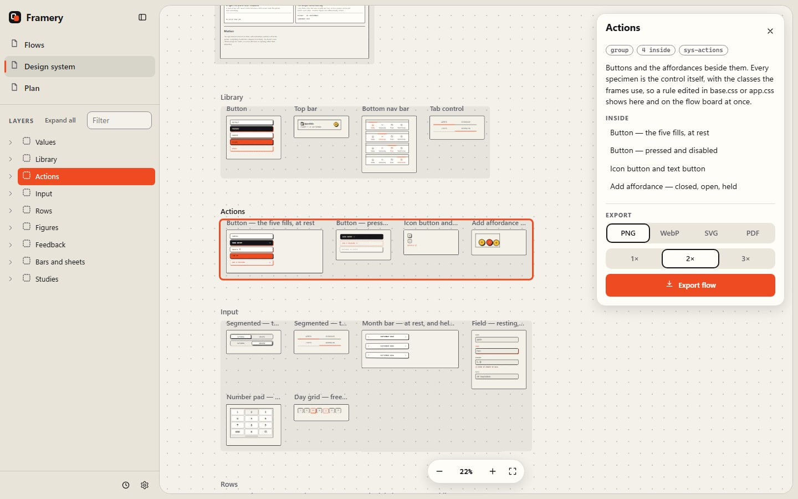
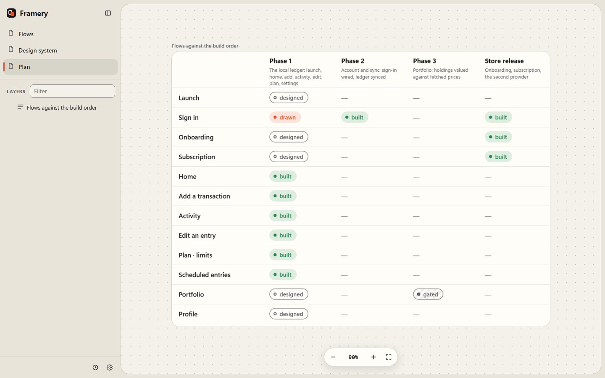
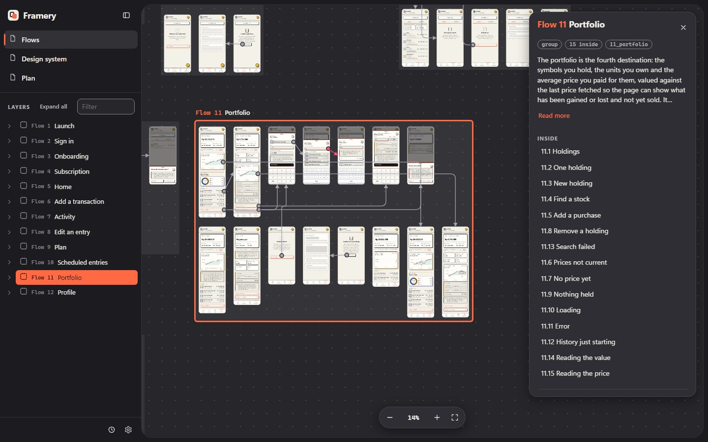

# Framery

**A local-first, agentic design board for solo developers.**

You describe what to design. Your coding agent lays it out on a canvas: screens, flows, a design system, a plan.
You look at it in the browser, think out loud, and ask for changes. Everything is plain files in your repo, there is
no account, no cloud and no build step, and there are no dependencies to install.



## Why

Solo developers design in their head, in a chat with an agent, or in a design tool the agent cannot touch.
Framery gives the agent a board it can read and edit through tools, and gives you a Figma-like surface to review it.

- **The agent edits, you review.** Every screen is an HTML file. Placement, grouping, arrows and descriptions
  are tools your agent calls (MCP, HTTP or CLI). The browser is where you look, pan and zoom.
- **Local-first.** Your design lives in `framery/` inside your project, next to your code, in git. Nothing leaves
  your machine.
- **Safe to let an agent loose.** Every prompt's changes are one entry in an undo trail: go back from the
  History panel, or tell the agent to undo.
- **Made for agents to read, too.** A flow is a small JSON file with descriptions for whoever builds the
  screen. `outline` prints a page as text in reading order, so an agent understands a flow without opening an image.
- **Light.** Plain Node, no dependencies. Previews are drawn by the Chrome or Edge you already have. The canvas
  draws only what is on screen.

## What you get

| | |
|---|---|
| **Free canvas** | Dotted, full-page, light and dark. Pan, pinch and zoom. Frames of any size (phone, tablet, desktop, custom), groups like Figma sections, flowchart nodes (diamonds for branches), and thin labelled arrows in green, red or grey. |
| **Arrows that mean something** | An arrow starts on the control that causes it ("tap Save") and ends on the screen it opens. Straight, curved or elbow lines. Arrows that cross, overlap or cut through a screen glow, with a count on the zoom bar. |
| **Details on click** | Click a screen, a group, a component or an arrow to read its description. Layers on the left, one row per component instance. |
| **Components** | A button used in forty screens is one definition. Change it once and every frame follows. Repeated markup is detected and can be promoted. |
| **Play the flow** | "Play from here" on a screen (or `P`) clicks through it like a prototype: the real page, live; a tap on a control with an arrow goes where the arrow goes, a diamond asks its question, and a misclick flashes what can be tapped. |
| **Design system and plan** | Pages are just boards. A design system page shows components alone; a plan page is a table (flows against phases) that agents update one cell at a time. |
| **Export** | Any frame, flow or table as png, webp, svg or pdf, from the detail panel. |
| **History** | Undo trail with restore. Each prompt is one step. |
| **Keys** | `.` and `,` step to the next and previous screen along the arrows (the happy path first). Arrow keys pan (Shift for more), `0` fits, `1` is 100%, `+` and `-` zoom, `[` folds the sidebar, `Esc` clears the selection, `/` or Ctrl+K finds anything on any page, `P` plays the flow from the selected screen. |

<table>
<tr>
<td width="50%"></td>
<td width="50%"></td>
</tr>
<tr>
<td align="center"><sub>Select a component: it is outlined on the screen, listed by instance in Layers, described on the right.</sub></td>
<td align="center"><sub>A design system page: components alone, details on click.</sub></td>
</tr>
<tr>
<td></td>
<td></td>
</tr>
<tr>
<td align="center"><sub>A plan is a table page. Agents change one cell at a time.</sub></td>
<td align="center"><sub>Dark mode. Screenshots here are from the design of a real app, drawn entirely through the tools.</sub></td>
</tr>
</table>

## Install

Requires **Node 22 or newer**. Previews, measured anchors and export use Chrome or Edge if one is installed;
without it everything else still works.

In your project's root folder:

```sh
cd my-project
npm install --save-dev github:rafimaliki/framery#v0.4.0
npx framery init
npx framery
```

Then open <http://127.0.0.1:4173> (if that port is busy, the studio takes the next free one and prints it).

`init` does four things, and is safe to run again:

1. Copies the **framery skill** into `.claude/skills/` and `.omp/skills/`, so your agent already knows how to
   operate the board. Claude Code, omp and anything that reads `AGENTS.md`-style skills pick it up.
2. Registers the **MCP server** in `.mcp.json` (existing entries are kept). Restart your agent once so it connects.
3. Adds the generated folders (`.cache`, `exports`, `.history`) to `.gitignore`.
4. Creates `framery/<your-project>/` with an empty project, if there is none.

From then on, ask your agent: *"Design the sign-in flow in framery"*, *"connect these screens"*,
*"add a plan page and mark home as built"*, *"undo that"*.

No MCP? The same tools run from a shell: `npx framery cmd outline '{"page":"flows"}'`, and
`npx framery tools` lists them all.

## Updating

Nothing updates by itself, and framery never calls the network. Updating is a choice you make:

```sh
npx framery doctor                                        # what is installed, and is this project in step?
npm install --save-dev github:rafimaliki/framery#v0.4.0  # pick a release (see CHANGELOG.md, or the tags)
npx framery init                                          # refresh the skill and the MCP entry
npx framery doctor                                        # confirm
```

- **Releases are git tags.** Pin the one you want; the install line above is the whole upgrade.
  `npm ls framery` shows what you have.
- **Your design is yours.** An upgrade replaces the app in `node_modules` and, with `init`, the skill copy.
  It does not rewrite `framery/`. A release that changes the data format says so in the changelog and
  ships its migration; a project saved by a newer version than the one installed is refused with a clear message,
  never half-read.
- **`doctor`** exits non-zero when the skill or MCP entry is out of date or a project needs a newer version, so you
  can run it in CI or a hook.

## Using it day to day

```text
npx framery                  start the studio on http://127.0.0.1:4173 or the next free port (--port N: that port or fail; --no-render)
npx framery mcp              the stdio MCP server (registered for you by init)
npx framery init             wire a project; safe to repeat
npx framery doctor           check versions and wiring
npx framery tools            every tool and what it does
npx framery cmd <tool> '{}'  run a tool from a shell
npx framery render           previews, anchor boxes, autoHeight heights
```

Edit anything on disk (an HTML frame, a CSS file, a page) and open pages update without a refresh. Frames are
ordinary HTML, drawn at their own size with your project's CSS. Give an element `id="…"` or `data-anchor="…"` and an
arrow can start or end on it.

### The tools an agent gets

`outline`, `get_page`, `add_item`, `update_item`, `rename_item`, `move_items`, `move_to_page`, `move_page`, `layout_flow`, `arrange`, `group_items`, `connect`, `check_arrows`, `check_design`, `check_tokens`,
`batch`, `list_anchors`, `set_cell` (and `add_row`, `add_column`, …), `set_token`, `render_frames`, `export_item`, `link`;
components: `create_component`, `update_component`, `use_component`, `promote_component`, `find_candidates`, …;
and `history`, `checkpoint`, `undo`, `restore`. The skill tells an agent which to reach for.

## A project folder

```text
my-project/
  framery/
    <project>/
      project.json     title, pages, tokens file, data format
      pages/<id>.json  items (frame, group, node, table) and arrows; a plan is a page with a table
      tokens.css       design tokens the frames use
      library.json     optional: components, with library/<id>.html (fragments with {{props}})
      *.html, *.css    your frames, any layout
      .cache/          previews and measurements (generated, safe to delete)
      exports/         files written by export_item
      .history/        the undo trail
```

A frame is an HTML file built from your own CSS. Edit pages through the tools, not by hand: they keep arrows valid
and groups fitted. The data format and decisions behind it are in [docs/design-studio.md](docs/design-studio.md).

## Status

Early (0.x). Solid for one person designing with one agent. Not built for real-time collaboration, and the
canvas is read-only by hand on purpose: placement comes from the agent. Node is the only supported runtime for now.

```sh
git clone https://github.com/rafimaliki/framery && cd framery
npm test          # node --test, no install step
npm run dev       # restart on change
```

## License

[MIT](LICENSE)
